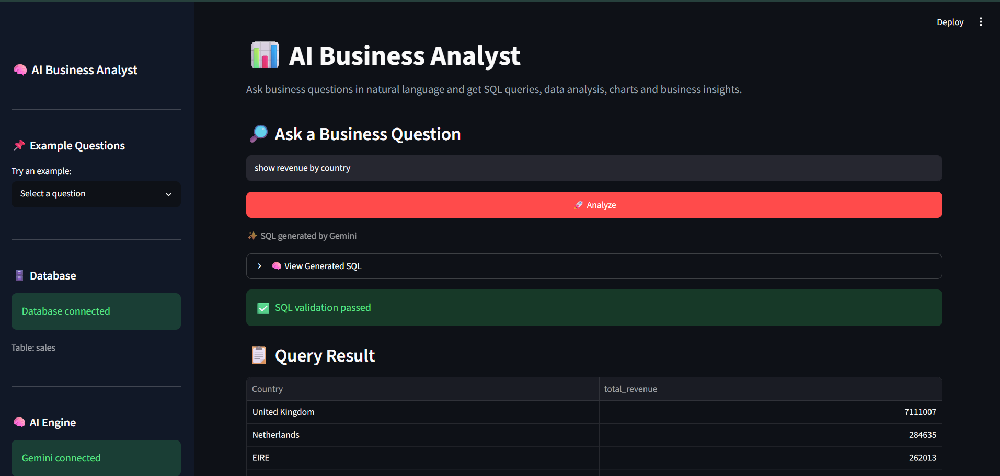
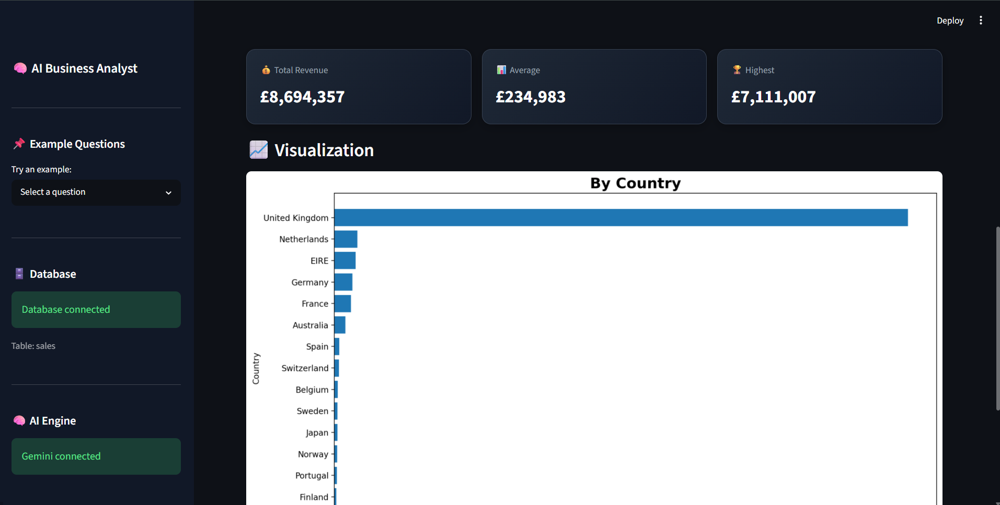

# 📊 AI Business Analyst

Ask business questions about retail sales data in plain English — get back real SQL, a chart, and a plain-language insight. No SQL knowledge required.

> "Show revenue by country" → "now just for Germany" → it remembers what you asked and adjusts.


---


## 📸 Screenshots

**Asking a question and getting the query result:**



**Auto-generated chart with KPI summary:**



**Plain-language business insight:**


---

## ✨ Features

- **Natural language → SQL** — powered by Google's Gemini API, not hardcoded pattern matching. Ask questions in your own words.
- **Conversation memory** — follow-up questions like *"now just for Germany"* or *"what about last year"* work because the app remembers your last few questions.
- **SQL safety validation** — every generated query is checked before it runs: SELECT-only, no destructive keywords, single statement, correct table.
- **Auto-generated charts** — line charts for trends, bar charts for comparisons, picked automatically based on what the query returns.
- **Plain-language insights** — a short written takeaway under every result, not just a table of numbers.
- **Graceful fallback** — if the AI engine is unavailable, the app falls back to a keyword-based query matcher instead of breaking entirely.
- **Fast repeat queries** — connection, query results, and AI responses are all cached, so asking the same thing twice is instant.

---

## 🛠️ Tech Stack

| Layer | Tool |
|---|---|
| UI / App framework | [Streamlit](https://streamlit.io) |
| AI / NL→SQL | [Google Gemini API](https://aistudio.google.com) (free tier) |
| Database | SQLite |
| Data handling | Pandas |
| Charts | Matplotlib |

---

## 🚀 Getting Started

### 1. Clone the repo
```bash
git clone https://github.com/swaran-krishna/ai-business-analyst
cd ai-business-analyst
```

### 2. Install dependencies
```bash
pip install -r requirements.txt
```

### 3. Get a free Gemini API key
1. Go to [aistudio.google.com](https://aistudio.google.com)
2. Sign in with any Google account
3. Click **"Get API key"** → **"Create API key"**
4. Copy the key (no credit card required, no expiration)

### 4. Add your key
Create a `.env` file in the project root:
```
GEMINI_API_KEY=your_key_here
```

> ⚠️ Never commit your `.env` file. It's already listed in `.gitignore`.

### 5. Run it
```bash
streamlit run App.py
```

The app will open at `http://localhost:8501`.

---

## 💬 Example Questions to Try

```
What is the total revenue?
Show monthly revenue
Which month had the highest revenue?
Show revenue by country
What are the top products?
Who are the top customers?
```

Then try a follow-up to see conversation memory in action:
```
Show revenue by country
→ now just for Germany
→ what about France instead
```

---

## 🔒 How It Handles Safety

User questions never touch the database directly. The flow is:

```
Question → Gemini generates SQL → validate_sql() checks it → SQLite runs it
```

The validator blocks:
- Anything that isn't a single `SELECT` statement
- `DROP`, `DELETE`, `UPDATE`, `INSERT`, `ALTER`, `ATTACH`, `PRAGMA`, `CREATE`
- Queries that don't reference the `sales` table

If Gemini is unavailable, the app falls back to a keyword-matching generator instead of failing outright.

---

## 📁 Project Structure

```
.
├── App.py              # Main application
├── retail.db           # SQLite database (sample retail transactions)
├── requirements.txt    # Python dependencies
├── screenshots/         # README screenshots
├── .env                # Your Gemini API key (not committed)
└── README.md
```

---

## 🧭 Roadmap / Ideas

- [ ] CSV export of query results
- [ ] Support for a second table (e.g. customer segments) with joins
- [ ] Configurable currency symbol
- [ ] Deploy to Streamlit Community Cloud

---

## 📝 License

MIT — feel free to fork and adapt.